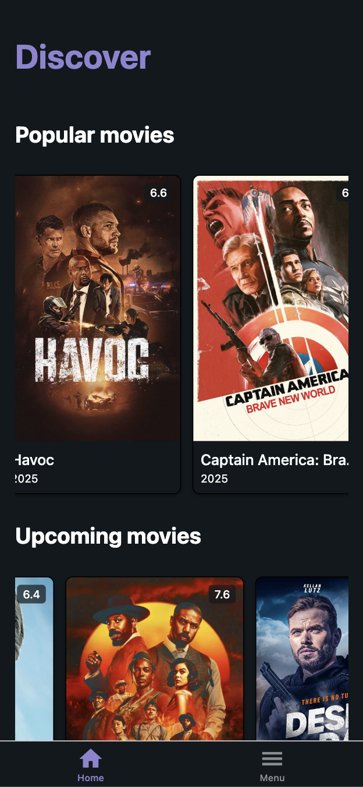
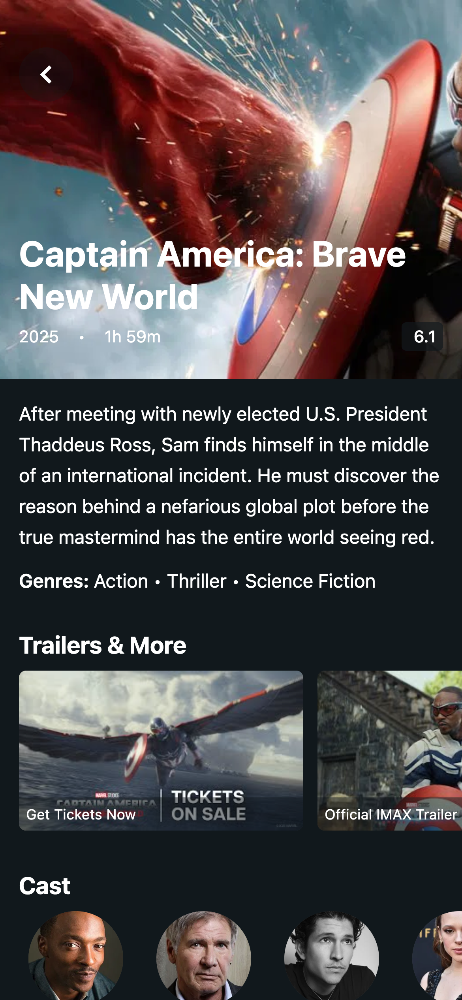

# Movie Discovery App

A React Native Expo application for browsing popular and upcoming movies, viewing movie details, This project was built for learning and demonstration purposes.

<div style={{ display: "flex", gap: "1rem" }}>
  
  
</div>


## Technical Features

*   Universal app (also works well with web!)
*   Efficient data fetching with TanStack Query (React Query).
*   Secure API key handling with Deno backend proxy.
*   Styling with NativeWind.

## Prerequisites

Before you begin, ensure you have met the following requirements:

*   [Node.js](https://nodejs.org/) (LTS version recommended) and npm/yarn.

## Setup

1.  **Clone the repository:**
    ```bash
    git clone https://github.com/butadpj/react-native-expo-latest.git
    cd react-native-expo-latest 
    ```

2.  **Install Frontend Dependencies:**
    Navigate to the root of the project (where `package.json` is) and run:
    ```bash
    npm install
    # or
    yarn install
    ```

3.  **Setup Environments:**
    *   Create a `.env` file in the root directory:
        ```
        EXPO_PUBLIC_API_URL=https://butadpj-deno-proxy-api.deno.dev
        ```

## Running the App

1.  **Start the Expo Development Server:**
    Open another terminal, navigate to the root of the React Native project, and run:
    ```bash
    npx expo start
    ```

2.  **Open the App:**
    *   Scan the QR code with the Expo Go app on your iOS or Android device.
    *   Or, you can just open the web version with the web link under the QR code

## Implementation Details

#### Movie Browsing (Home Screen)

*   The home screen (`HomeScreen.tsx`) displays movie categories like "Popular movies" and "Upcoming movies" 
*   A `SectionList` is used to manage these categories section. Each section has a title header.
*   Within each section, a horizontal `FlatList` is rendered to display a carousel of `MovieCard` components.
*   Data for these lists is fetched using TanStack Query's `useQuery` hook, calling a function that hits the Deno proxy server `https://butadpj-deno-proxy-api.deno.dev/api`
*   `React.useMemo` is used to process the fetched data, adapt it for the `MovieCard` (e.g., constructing full image URLs, formatting year/rating), and split it into the respective categories.

#### Navigation

*   **Expo Router** is used for file-based routing.
    *   Home screen: `app/(tabs)/(home).tsx`.
    *   Movie details screen is `app/movie/[id].tsx`. 
*   Tapping on a `MovieCard` navigates to `/movie/[id]`, passing the movie's `id` as a parameter.
```
router.push({
  pathname: `/movie/[id]`,
  params: {
  id: movie.id,
  },
});
```
*   The movie details screen retrieves the movie's `id` using `useLocalSearchParams` from Expo Router.
*   A custom back button (`/components/ui/BackButton.tsx`) is implemented on the movie details screen in which allows preserving the previous scrolled position of the user from the home screen (for good UX)

## Decisions, Challenges, and Bugs Faced

#### Decisions:

*   **Backend Proxy (Deno/Hono):** Chosen to securely store the third-party movie API key, preventing its exposure in the client-side bundle. Deno and Hono were selected for their simplicity and development speed.
*   **TanStack Query (React Query):** Implemented for robust server state management, caching, and simplifying data fetching logic (handling loading, error states, etc.).
*   **NativeWind:** Used for utility-first styling, allowing for rapid UI development.

#### Challenges & Bugs (and how they were addressed):

1.  **Network Connectivity (Mobile to Local Dev Server):** A significant hurdle was making API calls from a physical mobile device to the local Deno server. This was resolved by:
    *   Ensuring the device and computer were on the same Wi-Fi network.
    *   Using the computer's local network IP address in the frontend's `EXPO_PUBLIC_API_URL` instead of `localhost`.
2.  **`SectionList` Rendering Multiple Carousels:** Initially, the `renderItem` of `SectionList` was being called for every movie, creating many horizontal lists instead of one per section.
    *   **Fix:** Restructured the `data` prop for each section in `SectionList` to contain a single item. 

## Future Enhancements

*   Implement search functionality.
*   Offline caching/support.
*   Video playback for trailers within the app.

## Tech Stack

*   React Native (with Expo)
*   TypeScript
*   NativeWind (Tailwind CSS for React Native)
*   TanStack Query (React Query)
*   Expo Router
*   Deno (with Hono framework for the backend proxy)
*   TMDB API (or similar for movie data)

